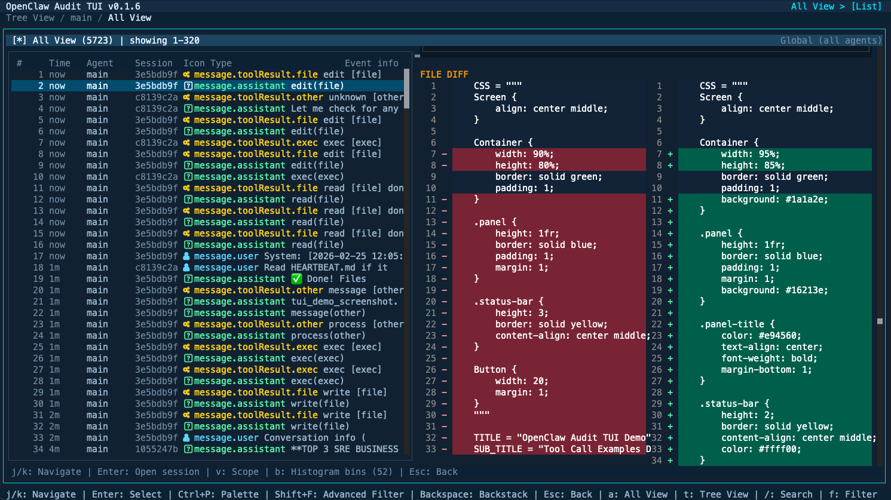

# openclaw-audit-tui
<div align="center">
  
  <h1 style="font-size: 28px; margin: 10px 0;">OpenClaw Audit TUI</h1>
  <p>X-Ray Openclaw agents</p>
</div>

[](https://badge.fury.io/js/openclaw-audit-tui)
[](https://opensource.org/licenses/MIT)
[](https://github.com/Sabrimjd/openclaw-audit-tui/releases)

Monitor all OpenClaw session events and stream them to any channel (Discord, Telegram, Slack, etc.) in real-time.




Terminal UI for auditing OpenClaw sessions, events, tool usage, and model behavior.

Built with OpenTUI React.

## Install

Global install (Bun):

```bash
bun add -g openclaw-audit-tui
openclaw-audit-tui
```

Global install (npm):

```bash
npm install -g openclaw-audit-tui
openclaw-audit-tui
```

From source:

```bash
bun install
bun dev
```

## Main views

- `All View` (default): global timeline across sessions with sparkline, scope toggle, and event detail inspector.
- `Tree View`: browse sessions grouped by agent, sorted by latest activity.
- `Entries`: inspect full session timelines with rich markdown/json and file diffs for edit/write tools.

## Session table metrics

Each session row includes:

- `Started` / `Last`
- `Events` / `Msgs`
- `Tools` (`toolCalls/toolResults`)
- `Err`
- `Prov` / `Model`
- `Tokens`
- flags (`[active]`, `[cmp:n]`, `[err]`, `[compact]`, `[model?]`)

## Search and filters

- `/` opens search in **All Events** directly.
- `Shift+F` opens advanced filters.
- Advanced filters support:
  - event/entry type
  - role
  - tool category
  - `Tool Name Contains` (use `edit` for file edits)
  - errors-only
  - free text

## Keyboard shortcuts

- `j/k` or arrow keys: move selection
- `Enter`: select/open
- `Backspace`: go back (navigation stack)
- `Ctrl+P`: command palette
- `a`: open All View
- `t`: open Tree View
- `v`: toggle All View scope (global/agent)
- `b`: cycle histogram bins
- `Esc`: back/close
- `q`: quit

## Icon mode

The UI uses Nerd Font icons when terminal support is available, with ASCII fallback.

- `AUDIT_TUI_ICON_MODE=nerd` forces Nerd Font icons
- `AUDIT_TUI_ICON_MODE=ascii` forces ASCII icons

## Notes for release

Project name for release: `openclaw-audit-tui`.

Recommended pre-release checks:

```bash
bunx tsc --noEmit
bun dev
```

## CI/CD

- CI runs on pull requests and pushes to `main`:
  - install dependencies with Bun
  - typecheck with `bunx tsc --noEmit`
- Release workflow runs on `v*` tags and creates a GitHub Release.
- NPM publish workflow runs on `v*` tag pushes (or manual dispatch) and publishes `openclaw-audit-tui`.

### NPM publish setup

Use npm Trusted Publisher (OIDC) with your GitHub repository. No long-lived `NPM_TOKEN` is needed once trusted publishing is configured.
